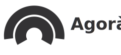

    <h1 align="center" style="width: 300px">
         
        
         
        Progetto IUM
         
    </h1>
    <h4 align="center">Progetto d'esame di Interazione Uomo-Macchina per il gruppo 11</h4>

## Scopo del sistema
Lo scopo del sistema è fornire a comunità di attivismo sociale una piattaforma unica dove poter far collettivo online, pubblicando eventi, notizie e comunicando tra loro.

Il progetto si è sviluppato a partire dal tema delle “Engaging Community e Inclusion”. Scelto il gruppo di riferimento è stata effettuata l'analisi della community scelta, la progettazione del sistema e infine l'implementazione.

Abbiamo scelto di realizzare il sistema come progetto [Next.js](https://nextjs.org/).

## Video Dimostrativo

## Autori

### Team Members

- [Antonio Marcone](https://github.com/amarcone42)
- [Giovanni Borrelli](https://github.com/GiovanniBorrelli)
- [Francesco Iantosca](https://github.com/FIANTOSCA)

